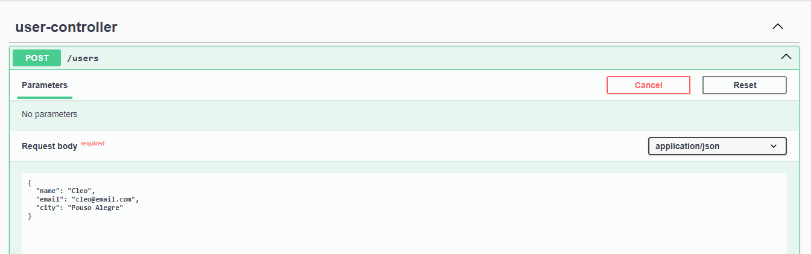
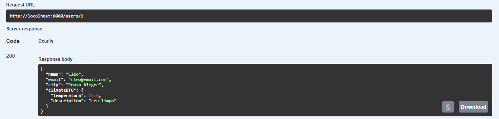

# 🌤️ UserWeatherAPI

API REST para cadastro de usuários com previsão do tempo, integrando com a API pública **OpenWeatherMap**. O projeto aplica os padrões de projeto **Facade**, **Singleton** e é preparado para o uso de **Strategy**.

---

## 📌 Funcionalidades

- ✅ CRUD de usuários (nome, e-mail, cidade)
- ✅ Busca de usuário por ID com retorno do clima atual da cidade
- ✅ Integração com API pública OpenWeatherMap
- ✅ Uso de padrões de projeto clássicos no backend

---

## 🎯 Tecnologias Utilizadas

- Java 21
- Spring Boot
- Spring Data JPA
- Spring Web
- OpenFeign
- H2 Database

---

## 🧱 Padrões de Projeto Aplicados

| Padrão     | Aplicação                                                                 |
|------------|---------------------------------------------------------------------------|
| **Facade**   | Simplifica o consumo da API OpenWeatherMap via classe `ClimaFacade`       |
| **Singleton** | Configuração automática de Feign Client e Beans via Spring               |
| **Strategy (preparado)** | A arquitetura permite fácil extensão para múltiplas APIs de clima |

---

## 📦 Estrutura de Pacotes

````bash
com.cleosilva.userweatherapi
├── controller # Endpoints REST
├── service # Regras de negócio
│ ├── facade # Camada de acesso à API externa
│ └── strategy (vazio) # Para futura extensão com múltiplas APIs
├── client # Cliente Feign da OpenWeather
├── dto # Objetos de transferência de dados
├── model # Entidades JPA
├── repository # Repositórios JPA
├── config # Configurações adicionais (se necessário)
└── UserWeatherApiApplication.java
````

---

## 🚀 Como Executar

1. Clone o repositório:

```bash
git clone https://github.com/cleosilva/userweatherapi.git
cd userweatherapi
```

Adicione sua chave da OpenWeatherMap em src/main/resources/application.properties:
```bash
openweathermap.api.key=SUA_CHAVE_AQUI
```
Execute o projeto:

```bash
./mvnw spring-boot:run
```
Acesse a H2 Console (opcional):
`````bash
http://localhost:8080/h2-console
`````
📬 Endpoints Disponíveis

🔹 POST /usuarios
````json
{
  "nome": "Maria",
  "email": "maria@email.com",
  "cidade": "São Paulo"
}
````
🔹 GET /usuarios/{id}

Retorna os dados do usuário e o clima atual na cidade cadastrada:

`````json
{
  "nome": "Maria",
  "email": "maria@email.com",
  "cidade": "São Paulo",
  "clima": {
    "temperatura": 23.5,
    "descricao": "céu limpo"
  }
}
`````
🔍 API Pública Utilizada

OpenWeatherMap API

### 📄 Documentação com Swagger

Cadastro usuário


Busca por Id retornando dados e clima da cidade


✨ Possíveis Melhorias Futuras
Estratégia com múltiplas fontes de clima (Strategy)

* Cache de previsões

* Testes com JUnit e Mockito


💻 Autor

Desenvolvido por Cleo Silva